<p align="center">
  
</p>

<p align="center">
  <a href="https://github.com/mxnklimt">
    
  </a>
</p>

<p align="center">
  <a href="https://github.com/mxnklimt?tab=followers">
    
  </a>
  <a href="https://github.com/mxnklimt?tab=stars">
    
  </a>
  
</p>

<br />

##  About Me

```txt
mxnklimt@github
------------------------------
Name       : Klimt Mxn / Wang Kaiyu
Focus      : Algorithms, LLMs, recommendation algorithms
Also       : AI Agent, C++, EDA, systems
Mode       : Build fast. Think deep. Ship clean.
```

I like turning algorithms into things that feel precise, fast, and useful. Recently orbiting around LLM systems, recommendation algorithms, AI Agent workflows, C++ projects, EDA competitions, and graphics/tooling.

## Tech Arsenal

<p align="center">
  
</p>

## Featured Builds

<table>
  <tr>
    <td width="50%" valign="top">
      <h3><a href="https://github.com/mxnklimt/ZJU_Oil">ZJU_Oil</a></h3>
      <p>Recent C++ build space for fast iteration and problem solving.</p>
      <p>
        
        
        
      </p>
    </td>
    <td width="50%" valign="top">
      <h3><a href="https://github.com/mxnklimt/EDACompetition2024">EDACompetition2024</a></h3>
      <p>Competition-oriented C++ work around algorithms, layout, and optimization.</p>
      <p>
        
        
        
      </p>
    </td>
  </tr>
  <tr>
    <td width="50%" valign="top">
      <h3><a href="https://github.com/mxnklimt/GO_ELO_PLUS">GO_ELO_PLUS</a></h3>
      <p>Go/ELO experiments with a systems-flavored engineering loop.</p>
      <p>
        
        
        
      </p>
    </td>
    <td width="50%" valign="top">
      <h3><a href="https://github.com/mxnklimt/GOELO">GOELO</a></h3>
      <p>Algorithmic experiments around ranking, scoring, and clean C++ implementation.</p>
      <p>
        
        
        
      </p>
    </td>
  </tr>
</table>

## Signal Board

<p align="center">
  
</p>

<p align="center">
  
  
</p>

<p align="center">
  
  
</p>

<p align="center">
  
</p>

<p align="center">
  
</p>

